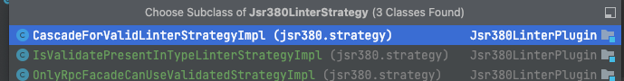
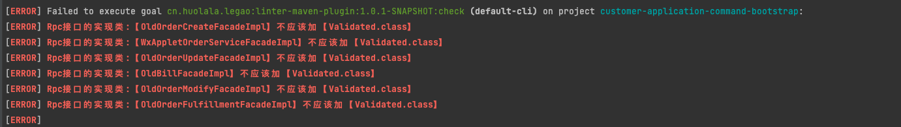
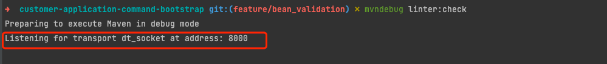
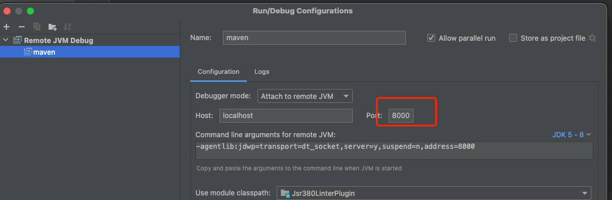
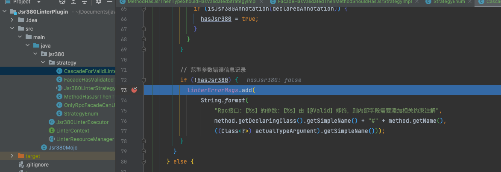

# 关于配置
配置在`Jsr380Mojo`类中都存在映射关系
## 扫描路径
默认：cn.huolala.customer.application.command

可以在使用mvn plugin时配置路径
```xml
<plugin>
    <groupId>cn.huolala.legao</groupId>
    <artifactId>linter-maven-plugin</artifactId>
    <version>1.0.1-SNAPSHOT</version>
    <configuration>
        <packageToScan>cn.huolala.customer.application.command</packageToScan>
        <strategyCodes>
            <strategyCode>PREVENT_MISS_USE</strategyCode>
            <strategyCode>VALIDATE_EXiSIT</strategyCode>
            <strategyCode>CASCADE_FOR_VALID</strategyCode>
        </strategyCodes>
    </configuration>
    <executions>
        <execution>
            <id>linter-check</id>
            <phase>compile</phase>
            <goals>
                <goal>check</goal>
            </goals>
        </execution>
    </executions>
 </plugin>
```
## linter策略
```xml
    <strategyCodes>
            <strategyCode>PREVENT_MISS_USE</strategyCode>
            <strategyCode>VALIDATE_EXiSIT</strategyCode>
            <strategyCode>CASCADE_FOR_VALID</strategyCode>
    </strategyCodes>

```

## 绑定mvn生命周期
```xml
  <executions>
        <execution>
            <id>linter-check</id>
            <phase>compile</phase>
            <goals>
                <goal>check</goal>
            </goals>
        </execution>
    </executions>
```
## 关于run time
目前三个linter策略，看注释可知含义



各个linter执行策略是fail fast的，一个策略检测到不符合规范，目标项目就会`BUILD FAILURE`，不会继续其他策略

不过每个策略内，会把目标文件都扫描一遍：




## 使用

插件配置在`customer-application-command-bootstrap`模块，在该模块执行 `mvn clean  install -Dmaven.test.skip=true -U `即可、这样比较快！！

在根目录/根pom.xml 执行 `mvn clean  install -Dmaven.test.skip=true -U ` 也行，会比较慢！

***
## 关于调试

* 应用项目的工程在终端执行`mvndebug linter:check`



插件项目勾选远程debug启动






